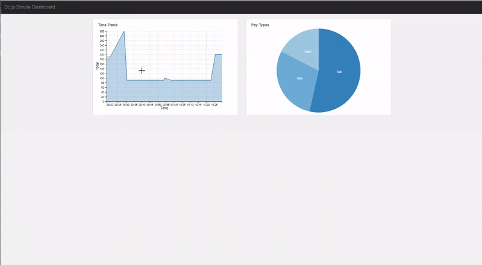

## dc.js Simple Dashboard

## References and examples 
<a href="https://keen.github.io/dashboards/" target="_blank">Open Source Keenio - website</a> 
<a href="https://github.com/d3/d3/blob/master/API.md" target="_blank">d3 - api</a> 
<a href="http://dc-js.github.io/dc.js/docs/html/" target="_blank">dc - api</a>
<a href="http://dc-js.github.io/dc.js/examples/" target="_blank">dc - examples</a> 

